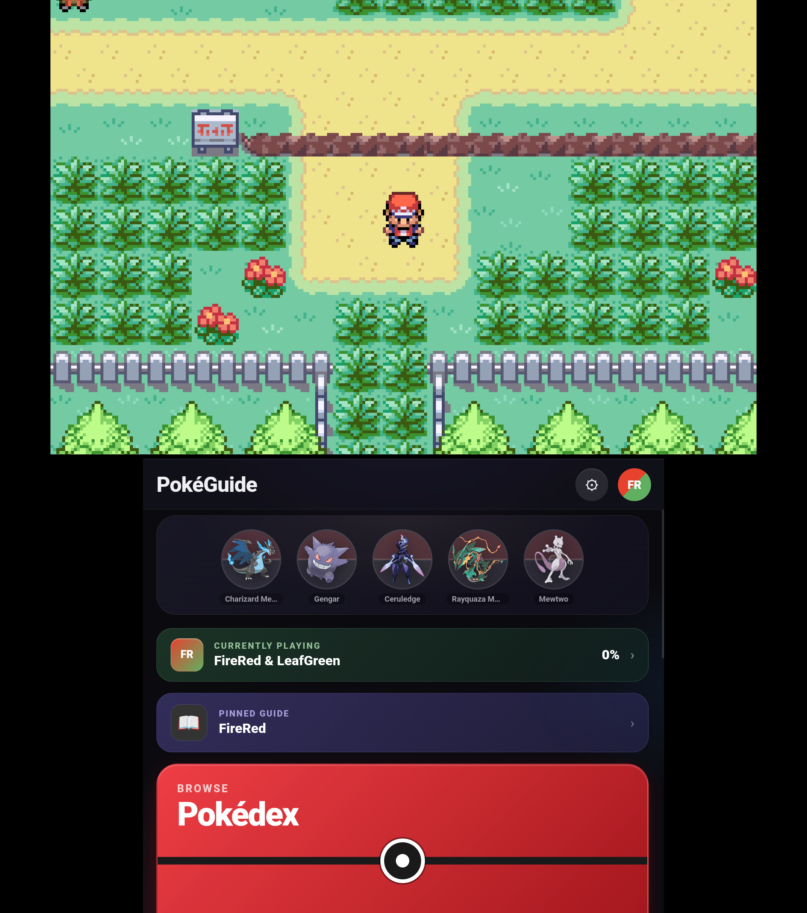
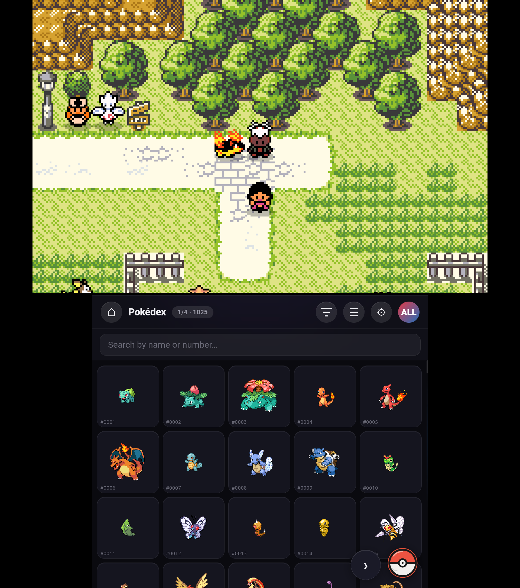
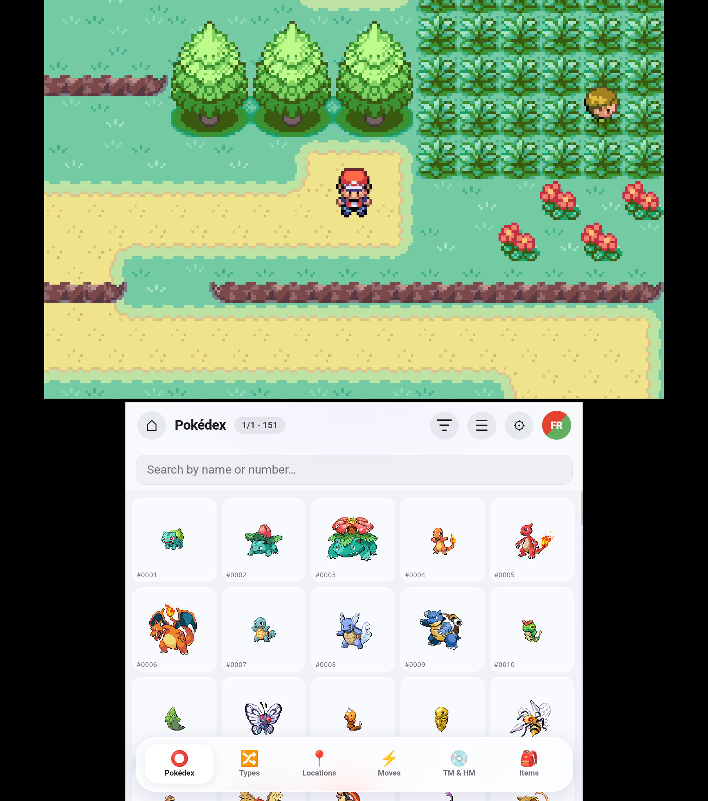
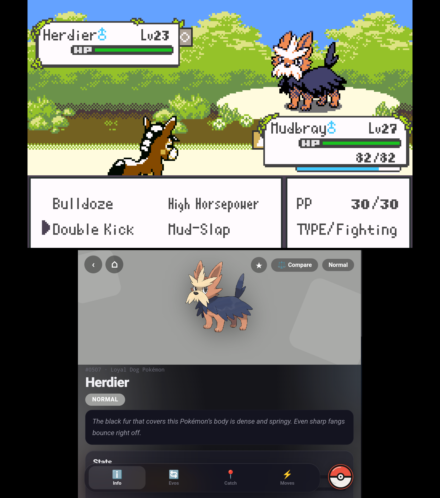
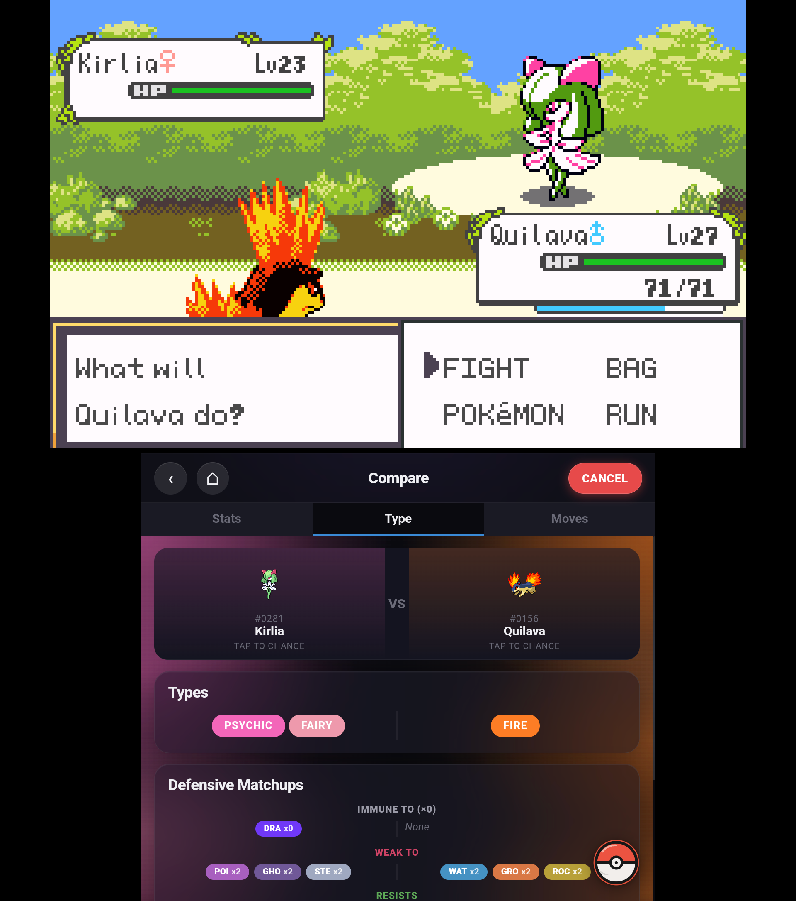
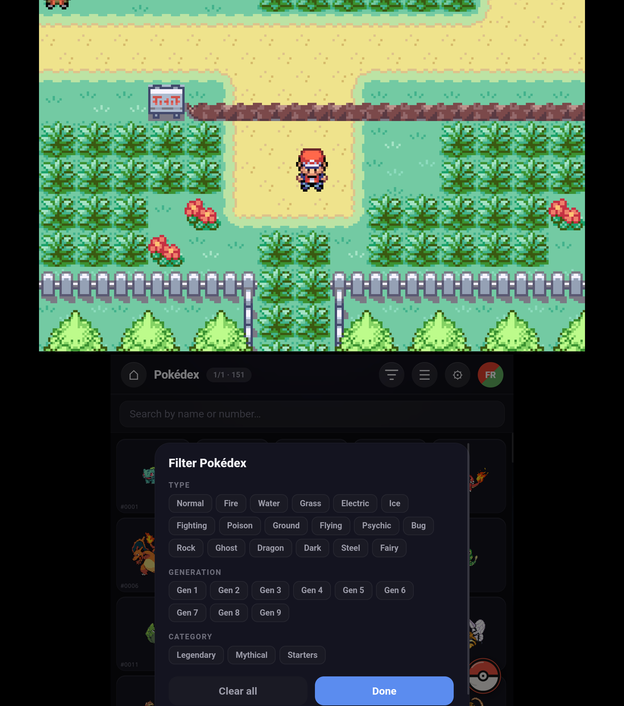
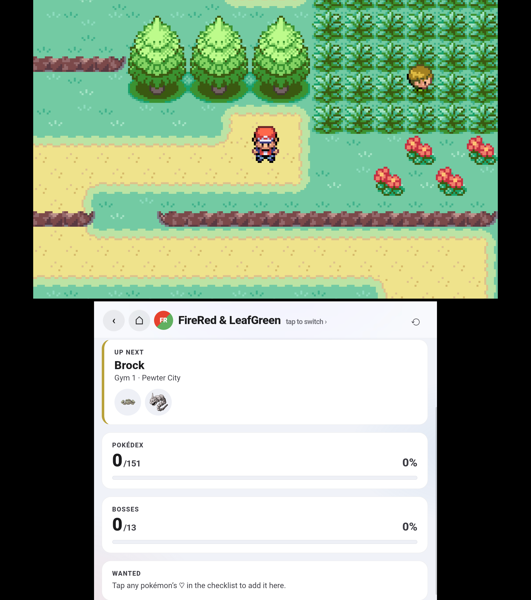

# PokéGuide

A Pokémon companion app built for the [AYN Thor](https://www.ayntec.com/pages/thor)'s bottom screen. Works on any Android 7.0+ device.

Pokédex, progress tracker, team builder, and walkthrough guide all in one.

<p align="center">
  
</p>

<p align="center">
  
  
  
</p>
<p align="center">
  
  
  
</p>
<p align="center">
  
</p>

## Features

**Pokédex** — Browse all 1,025 Pokémon with stats, types, evolutions, abilities, moves, and catch locations. Includes variant forms (Alolan, Galarian, Mega, etc.). Filter by type, generation, or category (Legendary, Mythical, Starters). Long-press any Pokémon for a quick stat preview.

**Progress Checker** — Track your caught/shiny/wanted Pokémon across 20 mainline games. Regional Pokédex scoped per game with bulk select, filters, and completion celebration.

**Compare** — Side-by-side stat comparison with type effectiveness indicators. Filter the picker to find matchups fast.

**Bosses** — 248 gym leaders, Elite Four, champions, trial captains, and Team Star bosses with full team data.

**Catch Data** — Curated encounter data for 9 games (BW, BW2, XY, ORAS, LGPE, SwSh, BDSP, Legends Arceus, SV) with locations, methods, rarity, and level ranges.

**Guide Browser** — Bookmark any walkthrough or wiki page and browse it in-app with resume scroll. Pin a guide to your launchpad.

**Favorites** — Pin up to 5 Pokémon to the launchpad as a trophy showcase.

**Moves & Items** — Full move database filterable by type or category. Tap any move for details.

**Offline Mode** — Download all data + sprites (~700 MB) for full offline use. Cache-first — never hits the network when data is available.

## Tech

Android WebView app (Java + vanilla JS/HTML/CSS). Data from [PokéAPI](https://pokeapi.co) and [PokémonDB](https://pokemondb.net). Min SDK 24, Target SDK 34.

## Building

```
git clone https://github.com/hythamjurdi/pokeguide-android.git
```

Open in Android Studio → Build → Run.

### Scraper (optional)

The `scripts/` folder contains the catch data scraper:

```
cd scripts && npm install
node scrape-catchability.js <game-id>
```

## Changelog

### v1.4.1
- Filter panels for Pokédex, Compare, Moves, and Progress Checker
- Long-press quick preview on grid tiles
- Compare: type effectiveness indicator, independent slot swapping
- Move detail popup from Pokémon detail view
- Scroll position remembered when navigating back
- Fixed false completion triggers in Progress Checker
- Fixed location names showing as bare numbers
- New app icon
- Various bug fixes and polish

### v1.4.0
- Guide browser with resume scroll and launchpad pin
- Favorites showcase
- Variant forms with switchable form strip
- Catch data expanded to 9 games (added BW, BW2, XY, ORAS)
- 248 bosses (added Trial Captains, Team Star)
- Ability descriptions, offline mode fixes, X/Y dex fix

### v1.3.0
- Progress Checker with per-game tracking
- Boss battle data across 20 games
- Curated catch data for 5 games
- Offline download, light/dark theme, liquid glass mode

## Credits

- Built with the assistance of [Claude](https://claude.ai) by Anthropic
- Pokémon data: [PokéAPI](https://pokeapi.co)
- Encounter & boss data: [PokémonDB](https://pokemondb.net)
- Sprites: [PokéAPI/sprites](https://github.com/PokeAPI/sprites)
